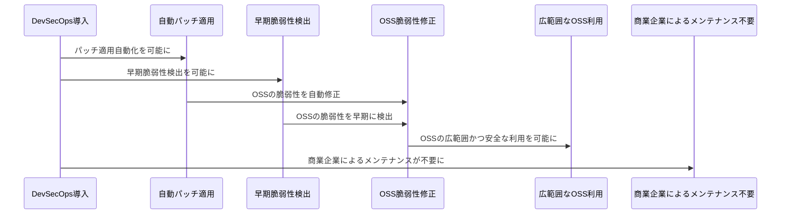

# GitLabのDevSecOps説明資料

## 概要

GitLabのDevSecOpsは、開発、運用、そしてセキュリティのプロセスを一体化し、自動化を通じてアプリケーションのリリース速度を保ちつつ、強力なセキュリティ対策を組み込む最先端のアプローチを提供します。この資料では、GitLabのDevSecOpsサービスがあなたのビジネスにもたらす潜在的な利点、適用理由、について詳しく説明します。

## 目次

- [GitLabのDevSecOps説明資料](#gitlabのdevsecops説明資料)
  - [概要](#概要)
  - [目次](#目次)
  - [ウォーターフォール→アジャイル→DevOps→DevSecOpsへの変遷と理由](#ウォーターフォールアジャイルdevopsdevsecopsへの変遷と理由)
    - [にウォーターフォール、アジャイル、DevOpsの違い](#にウォーターフォールアジャイルdevopsの違い)
    - [DevSecOps と DevOps の比較](#devsecops-と-devops-の比較)
    - [DevSecOpsの目的](#devsecopsの目的)
    - [DevSecOpsのメリット](#devsecopsのメリット)
      - [セキュリティ対策のシフトレフト](#セキュリティ対策のシフトレフト)
      - [サイクル間隔が狭くなったことと、Secを非専門家が対応が必要になった理由](#サイクル間隔が狭くなったこととsecを非専門家が対応が必要になった理由)
      - [DevSecOpsを実現するセキュリティツール](#devsecopsを実現するセキュリティツール)
    - [OSSの利用拡大](#ossの利用拡大)
    - [市場投入までの時間を短縮](#市場投入までの時間を短縮)
    - [規制コンプライアンスを確保](#規制コンプライアンスを確保)
    - [アプリケーションセキュリティのコスト](#アプリケーションセキュリティのコスト)
    - [セキュリティを意識した文化を構築](#セキュリティを意識した文化を構築)
    - [新機能を安全に開発](#新機能を安全に開発)
    - [Log4jの脆弱性とその理由](#log4jの脆弱性とその理由)
    - [Log4jの脆弱性問題は、DevSecOpsの重要性を強調しました。もし当時DevSecOpsがあれば、次のような方法でLog4jの問題を避けることができる](#log4jの脆弱性問題はdevsecopsの重要性を強調しましたもし当時devsecopsがあれば次のような方法でlog4jの問題を避けることができる)
  - [GitLabでのDevSecOpsの具体例](#gitlabでのdevsecopsの具体例)
    - [開発初期段階でのセキュリティスキャン](#開発初期段階でのセキュリティスキャン)
    - [継続的なセキュリティテスト](#継続的なセキュリティテスト)
    - [セキュリティ違反の自動検出と修正](#セキュリティ違反の自動検出と修正)
    - [ソフトウェアの脆弱性を早期に発見](#ソフトウェアの脆弱性を早期に発見)
  - [参考リンク](#参考リンク)

## ウォーターフォール→アジャイル→DevOps→DevSecOpsへの変遷と理由

### にウォーターフォール、アジャイル、DevOpsの違い

1. **ウォーターフォール開発**は線形なフェーズ進行により柔軟性が低く、問題が後から出てくると大きなコスト増と納期遅延を引き起こす可能性があります。
2. **アジャイル開発**は開発サイクルを小さなインクリメンタルな反復に分け、頻繁にフィードバックを受け取り、開発を進行します。
3. **DevOps**は、アジャイルの原則を引き継ぎつつ、開発と運用チームの協力を強化し、持続的なインテグレーション、デリバリー、デプロイメントを可能にする進化した形です。リリースのスピードと頻度を最大化し、変化に柔軟に対応できるようにするため、アジャイルの効果をさらに高めます。

[ウォーターフォールとアジャイル、DevOpsのリリースサイクルの比較表](https://engineering.mercari.com/blog/entry/2018-11-01-124027/)

### DevSecOps と DevOps の比較

1. **DevOps**と**DevSecOps**の最大の違いは、セキュリティの統合レベルです：DevOpsではセキュリティは一部が含まれますが、DevSecOpsではセキュリティが全プロセスに渡って強調されています。
2. **DevSecOps**では、開発チームやIT運用チームがセキュリティの責任を担い、セキュリティテストやコード分析を自動化するツールを用いて、継続的なインテグレーション、継続的なデリバリー、そしてパイプラインプロセスにおいて、リリース前に常にセキュリティチェックを行うプロセスが組み込まれています。
3. **DevSecOps**は、**DevOps**が目指すアプリケーション開発の高速化を維持しつつ、より強力なセキュリティプロセスを実践することを求めています。

[DevSecOps と DevOps の比較](https://pvs-studio.com/en/blog/posts/0710/)

### DevSecOpsの目的

DevSecOpsの目的は、システム開発全工程（要件定義、設計、実装、テスト、リリース、運用）におけるセキュリティリスクを削減し、システムの品質とセキュリティを向上させることです。これは、「ソフトウェアによるビジネス」の時代において、システムの不具合によるコスト増やリリースの遅延を防ぎ、ビジネスの発展を支えるために必要とされる重要なステップです。

### DevSecOpsのメリット

DevSecOpsの利点は主に3つあります。

1. **セキュリティリスクの抑制**: DevSecOpsはDevOpsを補完するセキュリティシステムであり、トラブルが発生してもすぐに対応することができます。

2. **生産性の向上**: DevSecOpsを用いることで、セキュリティトラブルの解決プロセスが短縮され、時間とコストを節約できます。これにより生産性が向上します。

3. **ビジネス要求の変化への柔軟な対応**: DevSecOpsを採用すると、システムの修正が容易になります。これにより、日々変化するビジネス要求に迅速に対応することが可能になります。

#### セキュリティ対策のシフトレフト

DevSecOpsの実践では、「シフトレフト」原則により、開発ライフサイクルの早い段階でセキュリティと他の開発プロセスが組み込まれ、ミスや運用コストが削減されます。これは単なるプロセスの変更であり、セキュリティ対策をより開発者中心にし、コーディングの途中で問題に対処する能力を開発者に提供します。

#### サイクル間隔が狭くなったことと、Secを非専門家が対応が必要になった理由

1. **デプロイの間隔短縮と人間によるセキュリティチェックの不可能性:** DevSecOpsの採用により、デプロイの間隔が短縮され、その結果、人間によるセキュリティチェックが不可能となります。
2. **全開発者のセキュリティ対策責任:** それゆえに全ての開発者がセキュリティ対策の責任を持つことが必要となります。結果として、セキュリティ対策の強化とリリースの高速化が同時に達成できます。

#### DevSecOpsを実現するセキュリティツール

1. **静的アプリケーションセキュリティ検査**
静的アプリケーションセキュリティ検査 (SAST) ツールは、独自のソースコードの脆弱性を分析して検出します。

2. **ソフトウェア構成分析**
ソフトウェア構成分析 (SCA) は、リスク管理、セキュリティ、およびライセンスコンプライアンスの目的で、オープンソースソフトウェア (OSS) の使用に関する可視性を自動化するプロセスです。

3. **対話型アプリケーションセキュリティ検査**
DevSecOps チームは、対話型アプリケーションセキュリティ検査 (IAST) ツールを使用して、本番環境におけるアプリケーションの潜在的な脆弱性を評価します。IAST は、アプリケーション内から実行される特別なセキュリティモニターで構成されています。

4. **動的アプリケーションセキュリティ検査**
動的アプリケーションセキュリティ検査 (DAST) ツールは、ネットワークの外部からアプリケーションのセキュリティをテストすることにより、ハッカーを模倣します。

[DevSecOpsを実現するセキュリティツールの役割](https://www.dx-digital-business-sherpa.jp/blog/what-is-devsecops#toc-2)

### OSSの利用拡大

DevSecOpsの導入により、自動化されたセキュリティパッチの適用と早期の脆弱性検出が可能となり、Red Hatのような商業企業による継続的なメンテナンスが得られないOSSでも、脆弱性を迅速に修正し、より広範囲かつ安全にOSSを利用することが可能となります。

### 市場投入までの時間を短縮

DevSecOps を利用すると、ソフトウェアチームはセキュリティテストを自動化し、人為的なミスを減らすことができます。また、セキュリティ評価が開発プロセスのボトルネックになるのを防ぐこともできます。

### 規制コンプライアンスを確保

ソフトウェアチームは、DevSecOps を使用し、専門的なセキュリティプラクティスとテクノロジーを採用することにより、規制要件に準拠します。システム内のデータ保護とセキュリティの要件を特定します。

### アプリケーションセキュリティのコスト

1.**セキュリティコストの予測可能性:** DevSecOpsの導入により、アプリケーションセキュリティのコストが予測しやすくなります。
2.**コスト削減:** 開発の初期段階からセキュリティを組み込むことで、後期のセキュリティ対策にかかるコストを削減できます。

### セキュリティを意識した文化を構築

ソフトウェアチームは、アプリケーションを開発する際に、セキュリティのベストプラクティスをより強く意識するようになります。彼らは、アプリケーションを構築するためのコード、モジュール、またはその他のテクノロジーの潜在的なセキュリティの問題をプロアクティブに発見します。

### 新機能を安全に開発

DevSecOps は、開発、運用、セキュリティの各チーム間の柔軟なコラボレーションを促進します。彼らはソフトウェアのセキュリティについて同様に理解できるようになり、評価とレポートを自動化するために共通のツールを使用します。全員が、セキュリティについて妥協することなく、顧客のための付加価値を増やす方法に焦点を合わせます。

### Log4jの脆弱性とその理由

この脆弱性は、Log4jのJava Naming and Directory Interface(JNDI)というJavaアプリケーションのための一般的な名前付けとルックアップAPIの使用に関わっています。Log4jの初期バージョンは、JNDIのメッセージ検索置換機能をデフォルトで有効にしていました。この機能を使用すると、攻撃者は慎重に作成したメッセージをアプリケーションに送信し、LDAPサーバーや攻撃者の制御下にある他のエンドポイントから読み込んだコードをアプリケーションに実行させることができます。このコードは、マルウェアのインストール、データの流出、アプリケーションのネットワーク上でのその他の悪意のある動作を実行させることができます。　がDevSecOpsの重要性を浮き彫りにする理由

### Log4jの脆弱性問題は、DevSecOpsの重要性を強調しました。もし当時DevSecOpsがあれば、次のような方法でLog4jの問題を避けることができる

1. 開発チームはアプリケーションを構築・管理する際に、Log4jなどのコンポーネントの最新バージョンを使用することが求められます。

2. DevSecOpsは、開発組織とテスト組織が、アプリケーションで使用されているオープンソースのコンポーネントを含むすべてのコンポーネントのバージョンを追跡することも求めています。そうすれば、ITセキュリティ・コミュニティが特定のコンポーネントの脆弱性を発表した場合、DevSecOps組織は、自社のアプリケーションに影響があるとすれば、どれかをすぐに判断することができます。

3. DevSecOps のベストプラクティスでは、アプリケーション内にセキュリティ制御を組み込むことを求めています。これにより、必然的に別のオープンソースのライブラリやコンポーネントに脆弱性が見つかった場合、チームはその脆弱性に対するゼロデイ攻撃を迅速かつ効果的に封じるための準備をすることができます。防御策がすでに導入されていれば、たとえ脆弱性に対するパッチが数日から数週間先であっても、組織は攻撃から身を守るために行動することができます。

4. 組み込みファイアウォールとゼロ・トラスト・セグメンテーションを活用し、許可されたユーザーやプロセスだけにネットワークトラフィックを制限します。これにより、攻撃者の行動範囲を制約し、システムへの侵入を防ぎます。

## GitLabでのDevSecOpsの具体例

GitLabでは、これらのDevSecOpsのアプローチを全面的にサポートしています。具体的な利用例としては、開発初期段階でのセキュリティスキャン、継続的なセキュリティテスト、セキュリティ違反の自動検出と修正などがあります。

### 開発初期段階でのセキュリティスキャン

GitLabでは、開発の初期段階からセキュリティスキャンを行うことができます。これにより、問題を早期に検出し、修正することが可能となります。

### 継続的なセキュリティテスト

GitLabは継続的なセキュリティテストを提供します。これにより、新たな脆弱性が発見された場合に迅速に対応することが可能となります。

### セキュリティ違反の自動検出と修正

GitLabでは、セキュリティ違反を自動的に検出し、可能な場合は自動的に修正する機能を提供しています。これにより、セキュリティ問題の解決がより迅速かつ効率的に行えます。

### ソフトウェアの脆弱性を早期に発見

ソフトウェアチームは、開発プロセス全体を通じてセキュリティの制御に重点を置きます。ソフトウェアが完成するまで待つのではなく、各段階でチェックを行います。ソフトウェアチームは、セキュリティ問題を早期に検出し、脆弱性の修正に関するコストと時間を削減できます。その結果、アプリケーションの作成後に、ユーザーの中断を最小限に抑え、セキュリティを強化できます。

## 参考リンク

    <a href="https://www.trend-sol.jp/">&copy; 2023 Trend-sol</a>

